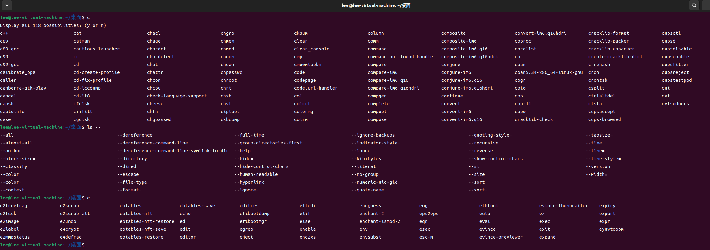
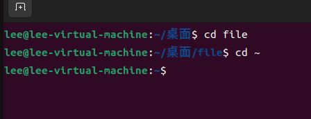

# ***第四题：SHELL***

 * 一.创建文件夹和文件，并完成相关修改等操作
   
  
  

 * 二.单引号，双引号区别
  >单引号：用单引号括起来的字符会保留引号内每个字符的字面值
  >双引号：允许shell解释￥，·，、，！ 即这些字符与双引号连用有特殊含义。
>>如：
   
   
>>又如：

* 三.实现历史命令的记录
  
  
* 四.shell内建命令

 1 . 判定

 用“type"命令可以判断一个命令是否为内建命令。

 2 . 具体命令
  - exit

      命令的返回值是其退出状态，退出状态用于检查命令执行的结果（成功/失败）。如果退出状态为0，则命令执行成功。如果命令失败，则退出状态为非零。同时从root中退出，从终端退出也是exit。

   - which

      which命令 用于查找并显示给定命令的绝对路径

  - alias
  
     可以将长串的命令或者参数简化成一个短的别名，方便用户快速调用。

     一般格式：alias [name[=value]]

     如
     

*  五.tab补全功能
  
  用户给定的字符串只有一条惟一对应的命令，直接补全，否则，再次Tab会给出列表
  
  
* 六.shell中. ... ~ - 解析

     - .的解析

      作用：1.拓展符号：如a.txt ， b.txt....
          
           2.当前目录：表示脚本当前所在目录

           3.执行：. a .txt  表示执行a.txt这个文件

     -  ... 的解析

       作用：1.在字符串替换和提取的模式种，表示对变量中特定位置或模式的替换或提取

     -  ~的解析

       1.在某些情况下，它可以表示用户的主目录。
  

       2.在字符串中，可以表示一个通配符，表示任意字符

     - -的解析

      1.表示命令行选项，如ls -l

   